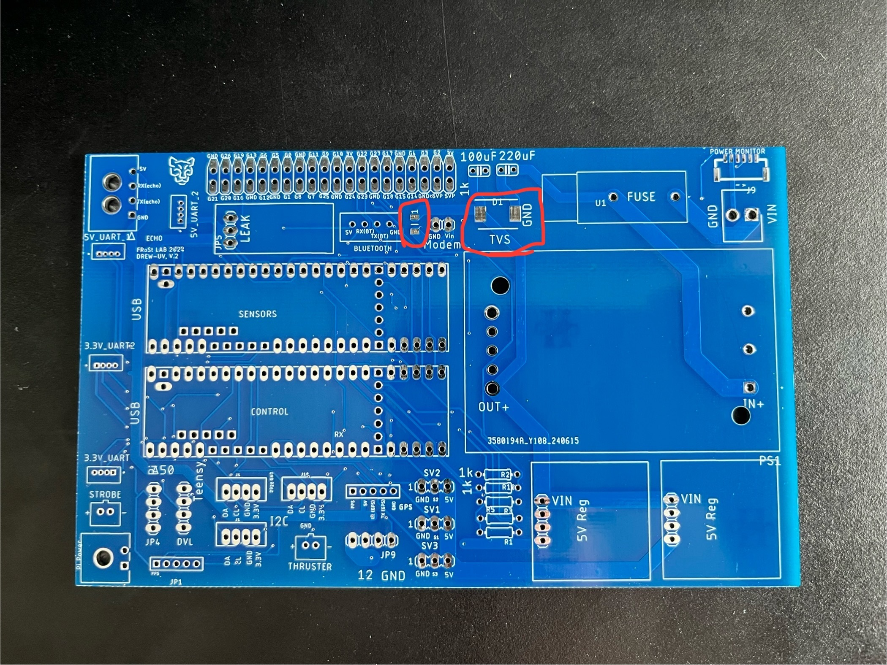
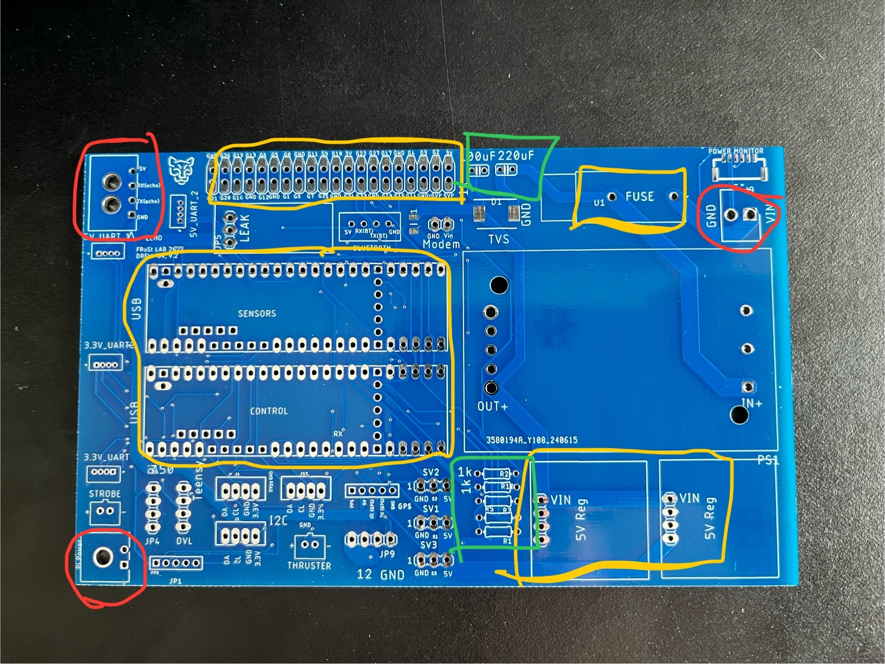
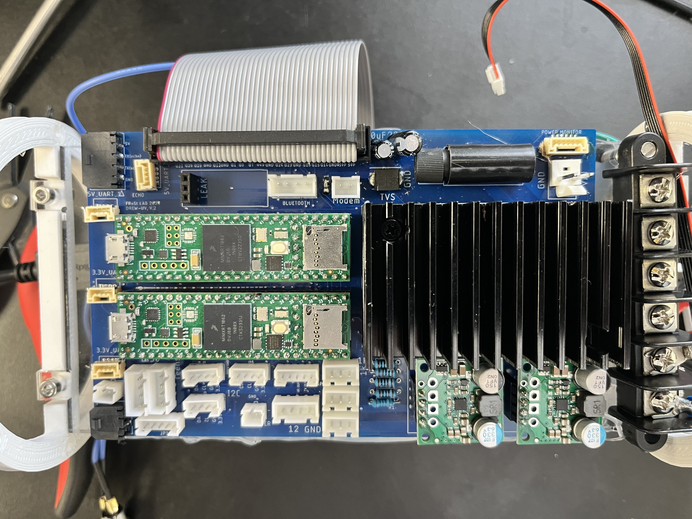

# Electrical Instructions

---
## Main COUG-UV PCB

Open the .brd and .sch files (found below) in a PCB design software. For our purposes we will use Eagle.

For our PCB production we used JLCPCB. In order to process the file correctly for JlCPCB you must first download their custom CAM processor. [Custom Eagle JLCPCB CAM](https://jlcpcb.com/help/article/9-How-to-Generate-Gerber-and-Drill-Files-in-Autodesk-Eagle)

Now return to Eagle under the the .brd tab. Within the toolbar line across the top you will see the cam processor. Open ie and load in the custom processor you downloaded earlier. When it is run you will end up with a .zip file which you will upload to the JLCPCB website.

### Links to Main PCB board (.brd and .sch)

**.brd:**
[COUG_powerboard.brd link](https://byu.box.com/s/raniskul3jnl1tf10c4lscgmdiiq0gin)

**.sch:**
[COUG_powerboard.sch link](https://byu.box.com/s/jcqulffcyls4dua039p1142ic2lz8b0v)

{: .note }
> Put these files in the same folder. This is essential for PCB design software like Eagle to recognize they go together.

---

## Strobe Light PCB

Utilizing the same method as above, you can send the strobe light PCB out for production. (Links found below)

### Links to Strobe PCB board (.brd and .sch)

**.brd:**
[.brd link](https://byu.box.com/s/raniskul3jnl1tf10c4lscgmdiiq0gin)

**.sch:**
[.sch link](https://byu.box.com/s/jcqulffcyls4dua039p1142ic2lz8b0v)

## PCB Assembly
\

This is the milled board from JLCPCB. To begin soldering the components onto the board I would recommend doing it in the following order.

### LittleFuse and TVS Diode
\

{: .note }
> Ensure you solder the TVS diode in the correct orientation.

### Headers
\

#### Solder the headers in this order.
1. Yellow (1.25 mm headers)
2. Red (2.0 mm headers)
3. Green (2.54 mm headers)

{: .note }
> I used the 1.25mm headers unconventially by soldering surface mount headers into through hole connections. I find it to be easier and sturdier this way.

### Final Components
\

#### Solder the components in this order.
1. Red (Molex headers and Fuse)
2. Yellow (Header pins)
3. Green (Resistors and Capacitors)
4. DC-DC converter

### Completed Board
\

